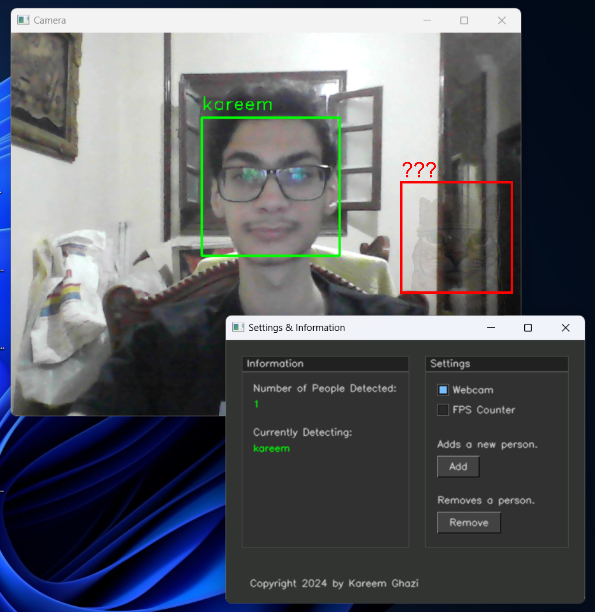
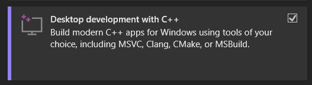
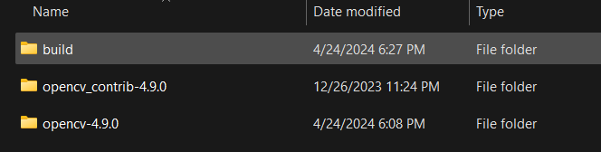
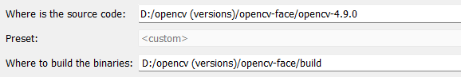
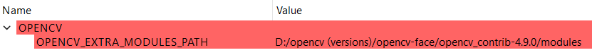
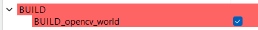
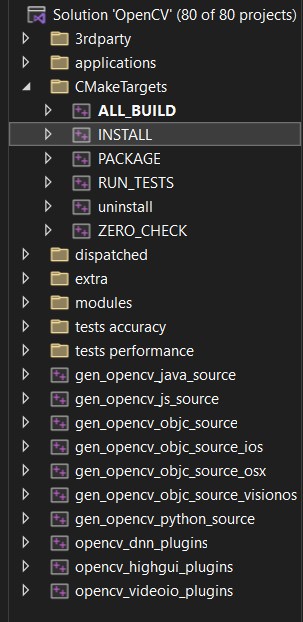
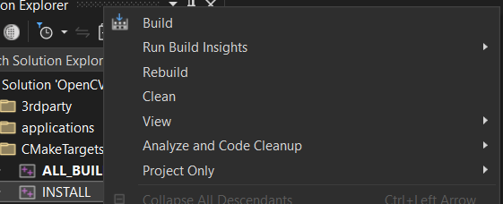

# Smart Surveillance System

This project is a smart surveillance system that could be used to recognize registered people on the system, detect how many people are there, or to monitor for suspicious or unknown people in a certain area.

The system has been built in C++ using [OpenCV 4.9](https://github.com/opencv/opencv) along with a header-only library for the GUI called [cvui 2.7](https://github.com/Dovyski/cvui). It utilizes the [Viola–Jones](https://en.wikipedia.org/wiki/Viola%E2%80%93Jones_object_detection_framework) algorithm for the facial detection. Additionally, it utilizes the [Eigenfaces](https://en.wikipedia.org/wiki/Eigenface) algorithm for facial recognition. The image processing runs on the CPU.

## Features

Some of the features currently implemented are: 

- Detecting faces.
- Recognizing registered faces.
- Information panel for keeping track of currently detected people in the frame.
- Options for enabling/disabling the webcam and the FPS counter.
- Adding people to the system.
- Removing people from the system. 

## Roadmap

These are some of the missing or uncompleted features for the project.

- String input isn't sanitized (*could write literally anything*).

## Screenshots



## Installation

Download the latest version from the [releases](https://github.com/kareem-ghazi/smart-surveillance-system/releases) section.
    
## Run Locally

### Building OpenCV
1. Download the source of the latest version of [opencv](https://github.com/opencv/opencv) and [opencv_contrib](https://github.com/opencv/opencv_contrib) (make sure both versions are the same).

2. Download [CMake](https://cmake.org/download/) and [Visual Studio 2022](https://visualstudio.microsoft.com/). 
- 

3. Place the opencv and opencv_contrib sources in the same folder along with an empty folder called build. 
- 

4. Set the source path to be your OpenCV source folder and the build path to be the build folder. After setting, configure. 
-  

5. Set the `OPENCV_EXTRA_MODULES_PATH` option to be the opencv_contrib/modules folder. After setting, configure. 
- 

6. Check the `BUILD_opencv_world` and `BUILD_opencv_face` options. After setting, configure and generate files. 
-  
- 

7. Open the project through CMake. Search for the INSTALL module and build it (two times, release & debug configurations). 
- 
- 

8. You're done! The binaries, lib, and include files are in the install folder. Do not forget to edit your environmental variables to include OpenCV in your users PATH. 
- 

### Running the Project
1. Clone the project

```bash
  git clone https://github.com/kareem-ghazi/smart-surveillance-system
```

2. Edit the `PATH` user environmental variable and add the path of OpenCV. (a pre-built version is available in the `lib` directory)
```
{LOCATION}\opencv\x64\vc17\bin
```

## License

[MIT](https://choosealicense.com/licenses/mit/)

